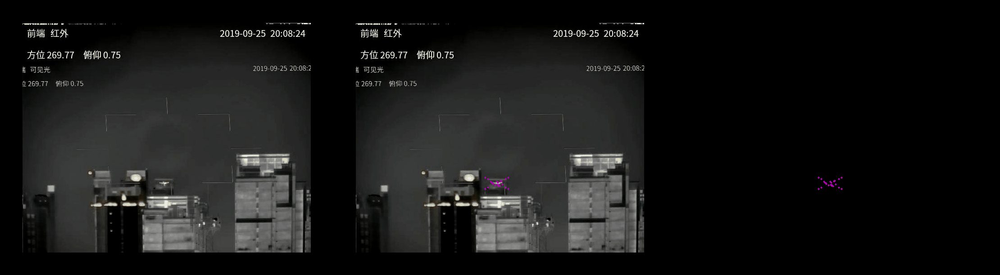
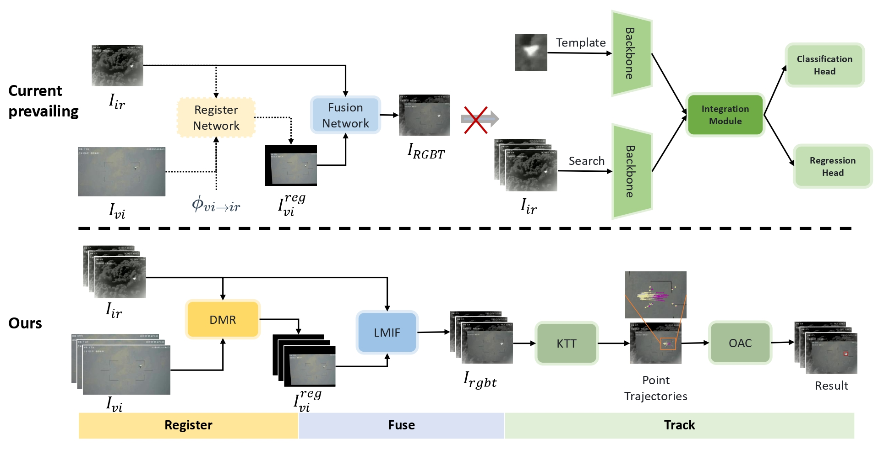
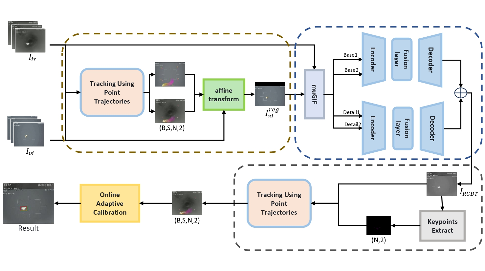

# Local Point Matching For Collaborative Image Registration and UAV Tracking

The code for paper “Local Point Matching For Collaborative Image Registration and UAV Tracking”

## Demo
 

 
Comparison of tracking pipeline. Current prevailing methods usually can’t
connect register, fusion, or track. Our framework can integrate these tasks into a whole.

 
The overview of our framework. It contains the DMR module, the LMIF
module, the KTT module, and the OAC module.
 
## Requirements
Notice that I created two separate virtual environments corresponding to the fusion model and the tracking model.
They each correspond to a requirements.txt in subfolder.
You can use it by:
``pip install -r requirements.txt``

