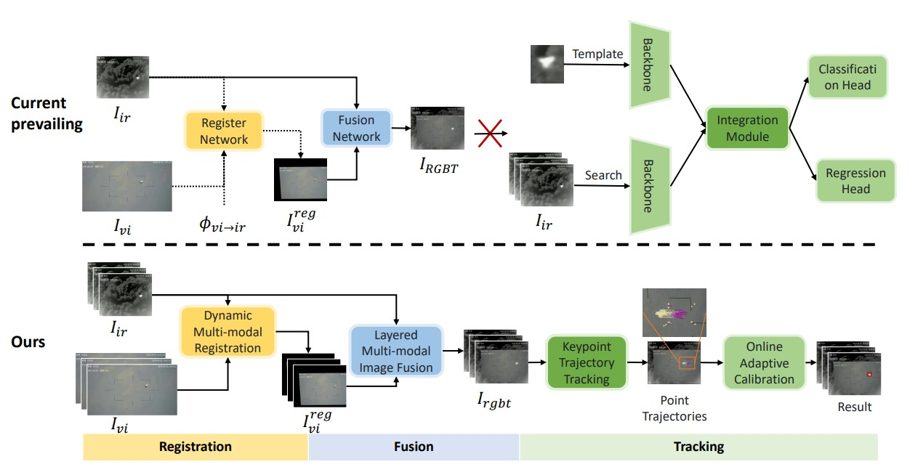
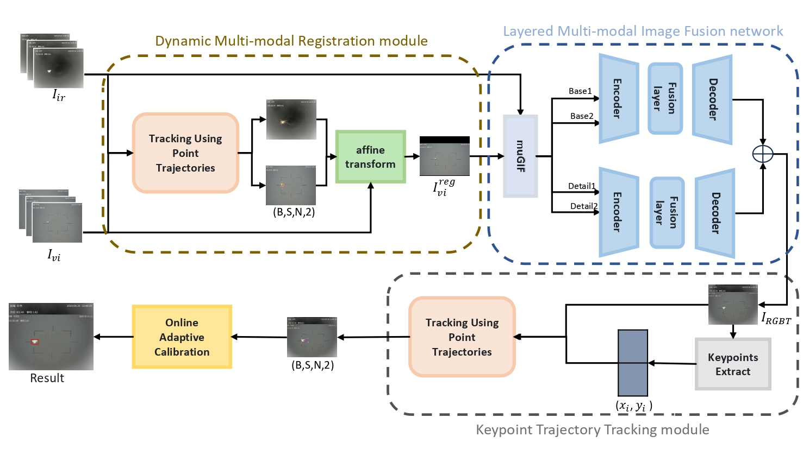

# Local Point Matching For Collaborative Image Registration and UAV Tracking

The code for paper “Local Point Matching For Collaborative Image Registration and UAV Tracking”

## Demo
 

 
Comparison of tracking pipeline. Current prevailing methods usually can’t
connect register, fusion, or track. Our framework can integrate these tasks into a whole.

 
The overview of our framework. It contains the DMR module, the LMIF
module, the KTT module, and the OAC module.
 
## Requirements
Notice that I created two separate virtual environments corresponding to the fusion model and the tracking model.
They each correspond to a requirements.txt in subfolder.
You can use it by:
``pip install -r requirements.txt``

## Anti-UAV Datasets
For the 1st Anti-UAV datasets you can find in the official repository for [Anti-UAV](https://github.com/ZhaoJ9014/Anti-UAV)

## How to use
Runs according to the framework in four modules:

### DMR
1. We should examine the trajectories of the two modalities separately. Configure the environment to download the offical pretrained reference model  from ,and we can use it by run:
``python tracking/demo.py``

1. The affine transformation matrix is then calculated by run:
``python tracking/affine matric.py``

and we can get aff_VIS images in ./Myoutputs/

### LMIF
3. Before fusing，we need to layer the infrared and registered visible images by "fusing/matlab_code_for_creating_base_and_detail_layers/main.m"

4. and then we can fuse by run 
   ``python fusing/test_image.py``
    Finally, we can get the fused Anti-UAV dataset in "fusing/outputs"

### KTT
5. In order to use Keypoint Trajectory Tracking module, we can run by this:
    ``python tracking/demo1.py``

### OAC
6. Eventually, we can get the prediction target box by run:
``python tracking/creat_bbox.py``

## Metric
To evaluate the anti-UAV problem, we can run:
``python tracking/Metric.py``

## Results
### Qualitative
 

### Quantitative
 

Our approach outperforms existing SOTA trackers on the Anti-UAV dataset, showing substantial improvements in tracking performance in diverse challenging scenarios.

### Metric_results
More details on the results of the experiment can be found here   
